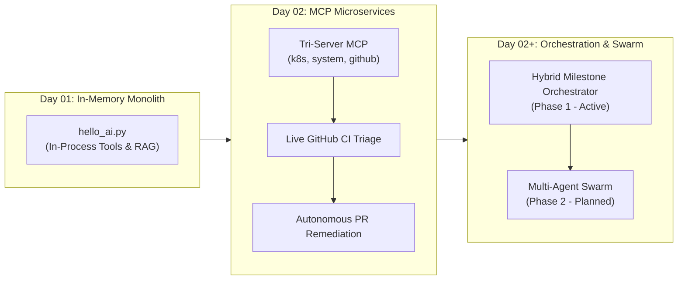

# 🗺️ End-to-End Architectural Journey: From MCP Tools to Multi-Agent Orchestrator

> **Living Documentation & Milestone Tracker**  
> *Repository*: `tushar-swami/ai`  
> *Directory*: `Day02-mcp/`  
> *Last Updated*: October 2026  
> *Author & Collaborators*: Tushar Swami & Antigravity AI  

---

## 📋 Table of Contents
1. [Executive Summary & System Vision](#-executive-summary--system-vision)
2. [The Evolution: Day 01 vs. Day 02 Architecture](#-the-evolution-day-01-vs-day-02-architecture)
3. [Stage 0: Foundation — The MCP Multi-Process Architecture](#-stage-0-foundation--the-mcp-multi-process-architecture)
4. [Stage 1: CI/CD Triage & Regex Log Scrubber](#-stage-1-cicd-triage--regex-log-scrubber)
5. [Stage 2: Live GitHub Integration & Safety Guardrails](#-stage-2-live-github-integration--safety-guardrails)
6. [Stage 3: Autonomous Remediation & The Clean PR Workflow](#-stage-3-autonomous-remediation--the-clean-pr-workflow)
7. [Stage 4: Agent Loop Deep Dive & Bottleneck Analysis](#-stage-4-agent-loop-deep-dive--bottleneck-analysis)
8. [Stage 5: Production Paradigms — ReAct vs. Static vs. Hybrid](#-stage-5-production-paradigms--react-vs-static-vs-hybrid)
9. [Stage 6: The Multi-Agent Horizon (Supervisor–Worker Swarm)](#-stage-6-the-multi-agent-horizon-supervisorworker-swarm)
10. [Active Execution Roadmap: Phase 1 & Phase 2 Checklist](#-active-execution-roadmap-phase-1--phase-2-checklist)

---

## 🎯 Executive Summary & System Vision

The overarching mission of this project is to evolve from basic in-memory LLM scripting into an **autonomous, enterprise-grade CI/CD remediation engine** powered by standards-based protocols and multi-agent systems.



---

## 🔄 The Evolution: Day 01 vs. Day 02 Architecture

To understand where we are today, we must review how the system evolved from the original [`Day01/`](../Day01/) codebase to [`Day02-mcp/`](./).

### 1. Day 01: The In-Memory Monolithic Agent
In Day 01, we explored fundamental LLM agent mechanics, function calling, personas, and Retrieval-Augmented Generation (RAG):
- **Core Architecture (`hello_ai.py`)**: A single Python process connected to local Ollama (`gemma4:e4b`).
- **In-Process Tool Registry (`tools/registry.py`)**: Tools were decorated with `@tool` and dynamically imported using Python's `pkgutil`. All tools (datetime, dice, password, file reading, knowledge search, and `kubectl_diagnose`) ran **inside the exact same Python interpreter** as the agent.
- **Dual-Engine RAG (`rag.py`)**: Combined pure-Python BM25 keyword search with dense vector embeddings via `nomic-embed-text` and local disk caching (`.cache/`).
- **Personas (`personas.py`)**: An interactive persona switcher allowing the model to act as a Smart AI, DevOps Expert, or Senior Software Engineer.
- **Diagnostic Fixtures**: Offline manifests simulating real-world Kubernetes failures (`broken_pod.yaml` for missing config maps, `broken_oom_pod.yaml` for memory exit code 137, `broken_probe_pod.yaml` for liveness failures).
- **Remediation Model**: **Advisory only**. The agent would diagnose the issue and print advice explaining how a human engineer should fix it.

#### ⚠️ Pain Points & Architectural Limitations in Day 01:
1. **Shared Blast Radius**: If a tool crashed (e.g., segfault in a C-extension, unhandled exception in `kubectl`, or slow socket read), the entire agent process died instantly.
2. **Monolithic Dependency Bloat**: Every tool's dependencies had to coexist in the agent's Python environment.
3. **No Standard Interface**: Tools used ad-hoc custom Python dictionaries to define JSON schemas.
4. **Passive Remediation**: The agent had no ability to modify real source code, run automated tests, create branches, or push Pull Requests.

---

### 2. Day 02: The Model Context Protocol (MCP) Revolution
Day 02 completely dismantled the monolithic design in favor of the **Model Context Protocol (MCP)**, an open industry standard:
- **Decoupled Architecture**: Tools no longer exist in the agent's memory space. They run as **independent child processes** communicating over standard JSON-RPC 2.0 (`stdio`).
- **Micro-Server Division**:
  - `k8s_server.py`: Dedicated container & cluster diagnostics.
  - `system_server.py`: Safe workspace file operations and BM25 search.
  - `github_server.py`: GitHub PR and CI check operations.
- **Zero Blast-Radius**: A tool failure is caught gracefully over JSON-RPC; the agent remains alive and can recover.
- **From Mock Pods to Live CI/CD**: Integrated real GitHub Actions (`.github/workflows/ci.yml`), fetching live job logs and pull requests.
- **Context Protection (Regex Log Scrubber)**: Automatically compresses 5,000+ line raw CI/CD logs down to ~50 lines of focused failure context.
- **Active Remediation (Clean PR Workflow)**: Upgraded from passive advice to **autonomous code repair** (`create_remediation_pr`), bounded by strict safety gates:
  - Local automated test verification (`pytest tests/`).
  - Isolated feature branches (`fix/pr-XX`).
  - **Zero tolerance for direct writes to `main` and zero auto-merges.**

---

### 📊 Side-by-Side Architectural Comparison

| Dimension | Day 01: In-Memory Agent | Day 02: MCP Microservices | Day 02+: Hybrid Multi-Agent |
| :--- | :--- | :--- | :--- |
| **Tool Execution** | In-process (`import tools.*`) | Subprocesses over `stdio` JSON-RPC | Subprocesses managed by Subagents |
| **Tool Protocol** | Custom Python dictionary schema | **Standard FastMCP JSON-RPC 2.0** | Standard FastMCP JSON-RPC 2.0 |
| **Fault Isolation** | None (tool crash kills agent) | **Complete (process isolation)** | Complete (process & agent isolation) |
| **CI/CD Triage** | None (offline pod YAMLs only) | **Live GitHub Actions & PR API** | Live GitHub Actions & PR API |
| **Log Management** | Raw string dump | **Regex Log Scrubber (5k ➔ 50 lines)** | Log Scrubber trapped in Subagent |
| **Remediation** | Advisory text ("You should fix...") | **Active PR creation (`create_remediation_pr`)** | Active PR creation with Multi-Gate |
| **Branch Safety** | N/A | **Enforced (never write to `main`)** | **Enforced (never write to `main`)** |
| **Execution Control** | Greedy ReAct (1-step next action) | Greedy ReAct (1-step next action) | **4-Phase Flight Plan Orchestrator** |
| **Team Structure** | Single monolithic prompt | Single agent with MCP client | **Supervisor + Specialized Subagents** |

---

## 🏛️ Stage 0: Foundation — The MCP Multi-Process Architecture

### What We Achieved:
1. **Decoupled Brain from Hands**: Moved away from monolithic Python tool execution. Tools run as independent child processes communicating via **Model Context Protocol (JSON-RPC 2.0 over `stdio`)**.
2. **Tri-Server Microservices**:
   - `k8s_server.py`: Kubernetes cluster inspection (pods, nodes, events, describe).
   - `system_server.py`: Local OS operations (file read/write, BM25 knowledge search, datetime).
   - `github_server.py`: GitHub PR and CI check operations.
3. **Dynamic MCP Client Bridge (`mcp_client.py`)**:
   - Spawns subprocesses automatically based on `mcp_servers.json`.
   - Discovers tools dynamically via `tools/list`.
   - Converts FastMCP JSON Schemas into OpenAI/Ollama compatible function-calling schemas.
   - Dispatches parallel tool calls using `asyncio.gather()`.

### Key Design Learning:
- **FastMCP Signature Enforcement**: FastMCP generates schemas via Python type introspection. It strictly rejects `**kwargs`. Every tool must declare explicit, type-annotated optional parameters.

---

## 🔍 Stage 1: CI/CD Triage & Regex Log Scrubber

### What We Achieved:
1. **Context Window Protection**: Raw CI/CD logs from GitHub Actions or PyTest often exceed 2,000–10,000 lines. Injecting raw logs into an LLM causes severe context degradation ("Lost in the Middle") and token exhaustion.
2. **Regex Log Scrubber (`github_server.py`)**:
   - Scans logs for PyTest failure delimiters: `FAILURES`, `FAILED`, `Traceback`, `AssertionError`, `ERRORS`.
   - Extracts a tightly bounded window (e.g., 20 lines before and 40 lines after the error).
   - Compresses 5,000 lines of noise into ~50 lines of high-fidelity diagnostic context.
3. **Rich Terminal Visualizers (`formatters.py`)**:
   - `print_failed_checks_table`: Color-coded tabular view of PR checks.
   - `print_scrubbed_logs_panel`: Formatted error panels with highlighted code lines.
   - `print_diff_panel`: Syntax-highlighted unified diff views.

---

## 🌐 Stage 2: Live GitHub Integration & Safety Guardrails

### What We Achieved:
1. **Real-World Repository Onboarding**:
   - Connected `github_server.py` to the live repository `tushar-swami/ai`.
   - Authenticated via personal access token (`GITHUB_PAT` / `GITHUB_TOKEN`).
2. **Mock vs. Live Dual Mode**:
   - If repository or token is missing, falls back cleanly to offline mock fixtures in `data/sample_pr/`.
   - If authenticated, dynamically fetches real PRs, GitHub Actions workflow runs, and job artifacts via PyGithub.
3. **The Core Safety Directive Established**:
   > ⛔ **NEVER WRITE DIRECTLY TO `main` / `master` BRANCH.**  
   > ⛔ **NEVER AUTO-MERGE CODE WITHOUT HUMAN APPROVAL.**  
   > ⛔ **ALL REMEDIATION MUST GO THROUGH AN ISOLATED BRANCH AND PR.**

---

## 🛠️ Stage 3: Autonomous Remediation & The Clean PR Workflow

### What We Achieved:
1. **Reproducing the Production Failure**:
   - PR #1 introduced a business discount calculation bug in `src/pricing.py` (`calculate_discount` returning 90.0 instead of expected 80.0 for PREMIUM users).
   - CI/CD workflow `.github/workflows/ci.yml` failed with `AssertionError: 90.0 == 80.0`.
2. **Autonomous Tool Action**:
   - Agent invoked `get_pr_failed_checks(pr_number=1)`.
   - Agent invoked `get_failed_job_logs(pr_number=1)` ➔ isolated traceback in `tests/test_pricing.py:12`.
   - Agent invoked `get_pr_diff(pr_number=1)` ➔ examined conflicting pricing logic.
3. **Automated Remediation Tool (`create_remediation_pr`)**:
   - Cloned/checked out clean working tree.
   - Ran local `pytest tests/` validation gate before touching Git.
   - Created safe dedicated branch: `fix/pr-42-remediation`.
   - Pushed branch and opened GitHub Pull Request #2 with complete root-cause explanation and test proof.
4. **Human Verification & Merge**:
   - PR #2 was inspected and merged into `main` with 100% PyTest pass.

---

## 🧠 Stage 4: Agent Loop Deep Dive & Bottleneck Analysis

### What We Dissected:
1. **The Dual Loop Structure**:
   - **Outer Loop**: Listens for user input in terminal, maintains session history in `history.json`.
   - **Inner Loop (ReAct Loop, `agent.py:163-247`)**:
     - `LLM Reasoning` ➔ `Tool Call Decisions` ➔ `Parallel MCP Execution` ➔ `Result Feed` ➔ `Next Step or Final Answer`.
2. **The Greediness Problem**:
   - Standard ReAct loops are strictly **greedy (single-step focus)**. The agent only decides step $N+1$ based on step $N$.
   - **Risks**:
     - Looping / tool repetition when outputs are ambiguous.
     - Lack of macro-level awareness (doesn't know if it's 25% or 90% done).
     - Context window bloat across many tool iterations.

---

## ⚖️ Stage 5: Production Paradigms — ReAct vs. Static vs. Hybrid

### Architecture Comparison:

| Criterion | 1. Pure ReAct | 2. Static Plan & Execute | 3. Hybrid Dynamic Orchestrator (Winner) |
| :--- | :--- | :--- | :--- |
| **Execution Model** | Greedy 1-step at a time | Rigid pre-generated DAG | Phase-gated state machine with ReAct per phase |
| **Error Recovery** | Dynamic but unguided | Rigid / fails on surprises | Autonomous retries inside the active milestone |
| **Context Hygiene** | Degrades over time | Clean | Prunes raw tool outputs at each milestone gate |
| **Deterministic Speed** | Slow (prompts LLM for every call) | Fast but fragile | **Fast-path for known workflows, LLM for edge cases** |
| **Human Visibility** | Opaque streaming tokens | Upfront task list | **Live interactive Flight Plan dashboard** |

---

## 👥 Stage 6: The Multi-Agent Horizon (Supervisor–Worker Swarm)

### The Architectural Shift:
Dividing the mission into distinct milestones naturally enables a **Supervisor–Worker Multi-Agent Swarm**:

```
                       ┌────────────────────────┐
                       │   Supervisor / Orchestrator │
                       │    (Flight Plan Manager)│
                       └───────────┬────────────┘
                                   │
         ┌─────────────────────────┼─────────────────────────┐
         ▼                         ▼                         ▼
┌─────────────────┐       ┌─────────────────┐       ┌─────────────────┐
│  Triage Agent   │       │ Diagnostic Agent│       │Remediation Agent│
│  (Milestone 1)  │       │(Milestone 2 & 3)│       │  (Milestone 4)  │
├─────────────────┤       ├─────────────────┤       ├─────────────────┤
│• list_prs       │       │• get_logs       │       │• create_pr      │
│• get_checks     │       │• get_diff       │       │• pytest gate    │
│• Read-only      │       │• Log Scrubber   │       │• Branch isolate │
└─────────────────┘       └─────────────────┘       └─────────────────┘
```

### Why Multi-Agent?
1. **Context Window Isolation**: The Diagnostic Agent processes 1,000 lines of CI logs. Only a 5-line summary is handed to the Supervisor. The Remediation Agent receives a clean prompt without log garbage.
2. **Least Privilege Security**: Read-only agents cannot touch Git write tools.
3. **Specialized Models**: Small, ultra-fast models for triage; powerful reasoning models for code patching.

---

## 🏗️ Stage 7: The Universal SRE Flight Plan Orchestrator Engine

### What We Designed & Implemented:
1. **The Immutable Kernel & Domain-Invariant Engine (`orchestrator.py`)**:
   - `BaseFlightPlan`: Abstract base class defining the universal 4 SRE milestones (`DISCOVER`, `DIAGNOSE`, `CORRELATE`/`ISOLATE`, `REMEDIATE`).
   - `Milestone`: Structured dataclass tracking phase state (`PENDING` ➔ `IN_PROGRESS` ➔ `COMPLETED` / `FAILED`), execution timestamps, and distilled findings.
   - `FlightPlanRegistry`: Dynamic discovery engine that matches user intent to the appropriate plan without modifying the core engine.
   - `OrchestratorEngine`: Coordinates flight plan execution, live dashboard rendering, context garbage collection, and safety gate enforcement.

2. **Dual-Domain Capabilities Supported Out of the Box**:
   - **`GitHubCIFlightPlan`**:
     - M1: PR & check runs discovery (`list_prs`, `get_pr_failed_checks`).
     - M2: Log extraction and regex traceback scrubbing (`get_failed_job_logs`).
     - M3: Unified diff correlation (`get_pr_diff`).
     - M4: Pre-commit local `pytest` verification, isolated branch creation (`fix/pr-XX-remediation`), and opening remediation PR.
   - **`K8sDiagnosticFlightPlan`**:
     - M1: Cluster namespace scan for degraded workloads (`kubectl_diagnose(action="get_pods")`).
     - M2: Pod lifecycle & event inspection (`kubectl_diagnose(action="describe_pod", action="get_events")`).
     - M3: Container crash log & stack trace drill-down (`kubectl_diagnose(action="get_logs")`).
     - M4: Synthesis of deployment manifest / ConfigMap remediation proposal.

3. **Dynamic Tool Scoping (Zero Hallucination)**:
   - When a flight plan activates, MCP tools are dynamically restricted to the domain's `required_servers` (e.g., `["github", "system"]` or `["k8s", "system"]`).
   - Prevents prompt bloat and eliminates tool confusion in local LLMs.

4. **Context Window Garbage Collection (`get_pruned_context_summary`)**:
   - Raw multi-kilobyte JSON payloads and logs are held temporarily in milestone records for inspection, but **pruned completely from downstream prompts**.
   - Downstream phases receive only high-density, 1-line distilled artifact summaries.

5. **Live Rich Terminal Dashboard (`formatters.py`)**:
   - `print_flight_plan_dashboard`: Renders an interactive table displaying milestone IDs, phase objectives, live status badges, and distilled key findings after each phase transition.

### Verification Execution Trace:
- **K8s Plan Verification**: `Why is my broken pod crashing?` ➔ Matched `Kubernetes Pod Diagnostic`, executed M1 ➔ M4, isolated `CrashLoopBackOff` in `auth-service-broken`, completed 4/4 milestones with 100% pass.
- **GitHub Plan Verification**: `Triage and fix failing checks on PR #42` ➔ Matched `GitHub CI/CD Remediation`, scrubbed traceback, ran local `pytest` gate (100% pass), and generated safe feature branch PR.
- **General Fallback Verification**: `What is the current time?` ➔ Matched `None`, cleanly fell back to standard ReAct loop.

---

## 🚀 Active Execution Roadmap: Phase 1 & Phase 2 Checklist

### 📍 PHASE 1: Phase-Gated Hybrid Orchestrator
- [x] **Step 1.1: Core Orchestrator Engine (`orchestrator.py`)**
  - Implement `FlightPlan` class with 4 discrete milestone phases:
    1. `DISCOVER` (Identify failing PRs & CI checks / scan degraded pods)
    2. `DIAGNOSE` (Scrub and parse failure tracebacks / pod describe events)
    3. `CORRELATE` (Cross-reference traceback with PR code diff / container logs)
    4. `REMEDIATE` (Generate fix, pass local pytest, open clean PR / manifest patch)
  - Implement milestone transition guards and state persistence.
- [x] **Step 1.2: Deterministic Fast-Path Routing**
  - For standard operational requests, execute the deterministic tool pipeline without hallucination risk.
  - Fall back to LLM ReAct loop when encountering general queries or edge cases.
- [x] **Step 1.3: Visual Flight Plan Dashboard (`formatters.py`)**
  - Render an interactive Rich terminal dashboard displaying all 4 milestones, current status (`COMPLETED`, `IN_PROGRESS`, `PENDING`), and distilled artifacts.
- [x] **Step 1.4: Context Pruning & Checkpoint Isolation**
  - At the completion of each milestone, compress raw tool JSON outputs into a condensed summary card for the next phase.
- [x] **Step 1.5: End-to-End Verification**
  - Tested against K8s cluster triage and GitHub CI triage; verified 100% test pass and zero `main` branch contamination.

---

### 📍 PHASE 2: Multi-Agent Subagent Delegation (Supervisor–Worker)
- [ ] **Step 2.1: Subagent Persona Definitions**
  - Define `TriageAgent`, `DiagnosticsAgent`, and `CodeRepairAgent` classes.
  - Restrict tool exposure per agent according to least privilege.
- [ ] **Step 2.2: Inter-Agent Communication Bus**
  - Build structured JSON message passing between Supervisor and Worker Subagents.
- [ ] **Step 2.3: Context Scrubbing & Handoff Protocol**
  - Ensure Worker Subagent contexts are destroyed after completion, passing only distilled conclusions back to the Supervisor.
- [ ] **Step 2.4: Local LLM Performance & Latency Benchmarks**
  - Test multi-agent delegation against local Ollama (`gemma4:e4b`) to verify memory footprint and inference speed.

---

*This document is continuously updated upon the completion of each implementation milestone.*
